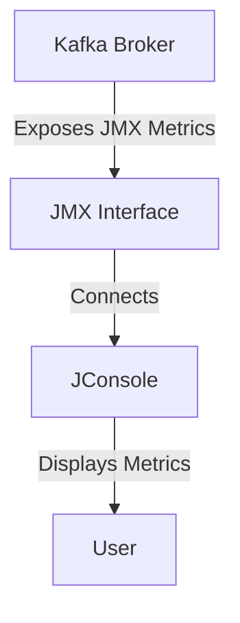
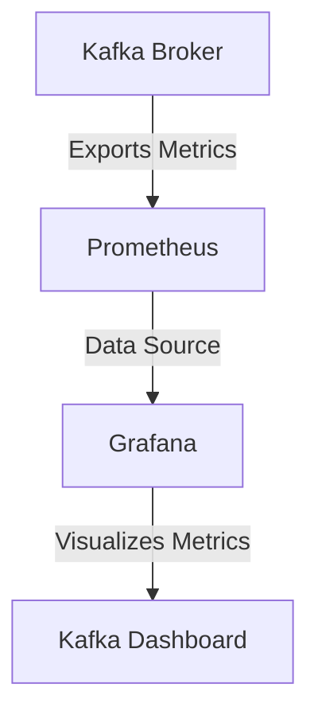

# 13. Monitoring & Operations

This tutorial will help you understand how to monitor and operate Apache Kafka. We will use simple English for easy understanding.

---

## Metrics

Metrics are numbers that show how Kafka is working. They help you find problems early.

### JMX

Kafka uses JMX (Java Management Extensions) to expose metrics. Tools like JConsole can connect to Kafka and display these metrics in a graphical interface.

**Example metrics:**
- Number of messages sent
- Number of errors
- Memory usage

**Workflow diagram:**

This diagram shows how Kafka brokers expose metrics via JMX, which can be accessed by JConsole for monitoring.

### Prometheus

Prometheus is a tool that collects metrics from Kafka. You need a Prometheus exporter for Kafka. Prometheus stores the metrics and lets you search them.

### Grafana

Grafana is a tool to show metrics as graphs. You can connect Grafana to Prometheus. This helps you see Kafka’s health in pictures.

**Steps:**
1. Set up Prometheus to collect Kafka metrics.
2. Connect Grafana to Prometheus.
3. Create dashboards in Grafana.

**Example diagram:**

This diagram shows how Kafka metrics flow from the broker to Prometheus, and then to Grafana for visualization.

---

## JConsole vs. Grafana: Which Should You Use ?

**JConsole** is best for quick, direct inspection of Kafka’s internal metrics via JMX. It’s useful for troubleshooting, debugging, and exploring detailed MBean data in real time. Use JConsole when you need to connect directly to a Kafka broker and view low-level metrics.

**Grafana** is ideal for ongoing monitoring and visualization. It lets you create dashboards, track trends, and set alerts using data from Prometheus. Use Grafana for continuous health checks, performance tracking, and sharing insights with your team.

**Summary:**  
- Use **JConsole** for immediate, detailed troubleshooting.  
- Use **Grafana** for long-term monitoring and visualization.

---

## Log Monitoring

Kafka writes logs about its work. Logs help you find problems.

**How to monitor logs:**
- Check Kafka log files regularly.
- Use tools like ELK Stack (Elasticsearch, Logstash, Kibana) to search and view logs.

**What to look for:**
- Errors
- Warnings
- Slow operations

## Common Troubleshooting

Sometimes Kafka has problems. Here are common issues and how to fix them:

### 1. Broker not starting

- Check the logs for error messages.
- Make sure the port is not used by another program.

### 2. Slow performance

- Check metrics for high CPU or memory usage.
- Make sure disks are not full.

### 3. Message loss

- Check if replication is working.
- Make sure brokers are healthy.

**Tip:** Always check metrics and logs first when you have a problem.

---

By following these steps, you can keep Kafka running smoothly and fix problems quickly.

---

## Setups

### 👉 [How to setup JConsole](../resources/setup-monitoring-ops.md#how-to-setup-jconsole)
### 👉 [How to setup Prometheus](../resources/setup-monitoring-ops.md#how-to-setup-prometheus)
### 👉 [How to setup Grafana](../resources/setup-monitoring-ops.md#how-to-setup-grafana)

